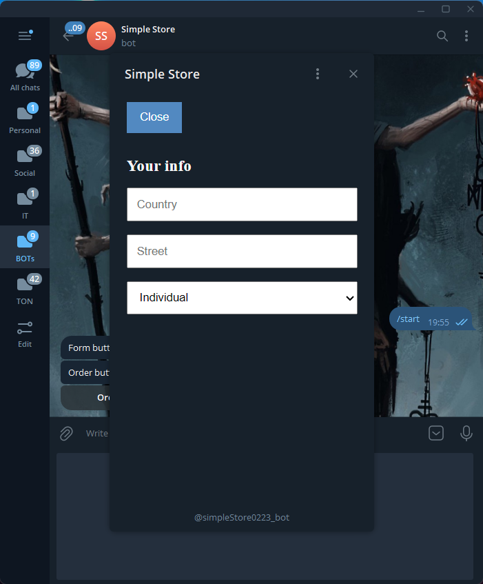
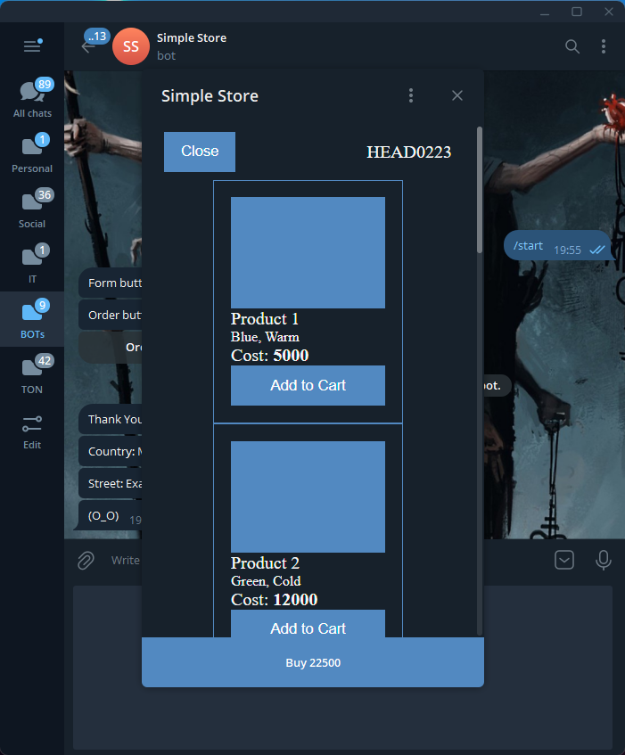
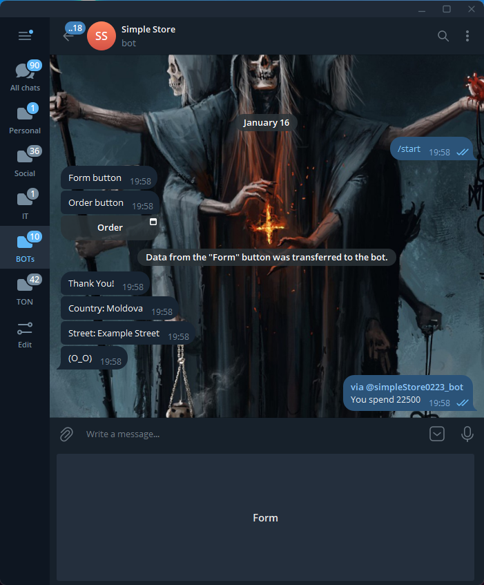

# Simple Store (**Client**) · Telegram Bot


[](https://app.netlify.com/sites/simple-store-web-app/deploys)


The Simple Store Client serves as the user interface for the associated Telegram Bot.

## Table of Contents

-  [Folder Structure](#folder-structure)
-  [Usage](#usage)
-  [Media](#media)
-  [Contributing](#contributing)
-  [Dependencies](#dependencies)

## Folder Structure

-  **public:** Contains public assets and the main HTML file.
-  **src:**
   -  **components:** Reusable components.
   -  **hooks:** Custom React hooks for managing state and logic in functional components.
   -  **App.js:** Main component rendering routes and managing state.
   -  **index.js:** Entry point of the application.

## Usage

1. Clone the repository:

```bash
git clone https://github.com/HEAD0223/simple-store-web.git
cd simple-store-web
```

2. Install dependencies:

```bash
npm install
```

3. Start the development server:

```bash
npm start
```

4. Visit `http://localhost:3000` in your browser to see the application.

## Media






## Contributing

If you would like to contribute to this project, please follow these steps:

1. Fork the repository.
2. Create a new branch for your feature: `git checkout -b feature-name`
3. Commit your changes: `git commit -m 'Add some feature'`
4. Push to the branch: `git push origin feature-name`
5. Submit a pull request.

## Dependencies

-  **React:** JavaScript library for building user interfaces.
-  **React Router:** Declarative routing for React.js.

Make sure to include these dependencies in your project.
